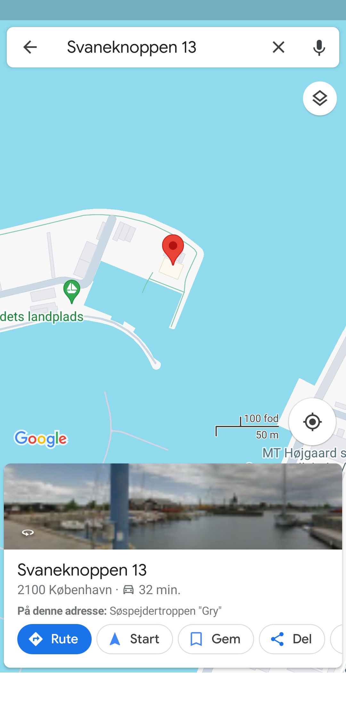

# Drilske Dæknavne - Address
Denne opgave er i forlængelse af serien om "Drilske Dæknavne". Denne del tage udgangspunkt i, at du har læst ["email"](./Drilske%20Dæknavne%20-%20Email.md) først.

## Opgaven
Opgavebeskrivelsen er den samme om i første del om "email", dog er følgende tilføjet: 

> Vi har også brug for at vide hvor Martin planlægger at hente de afhentede stoffer henne. Vi forventer en adresse, således flaget vil være DDC{GadenavnNummer}.

## Løsning
Ved at kigge lidt videre rundt i telefonen, kan det være relevant at kigge på eventuelle screenshots eller billeder på telefonen. 

Der findes screenshots på telefonen i stien:
```
/data/system_ce/0/snapshots
```

Ved at kigge billederne igennem, vil adressen `Svaneknoppen 13` fremgå på flere billeder. Ligeledes optræder e-mailadressen fra første del også. 

Flaget er dermed: 
```
DDC{Svaneknoppen13}
```



