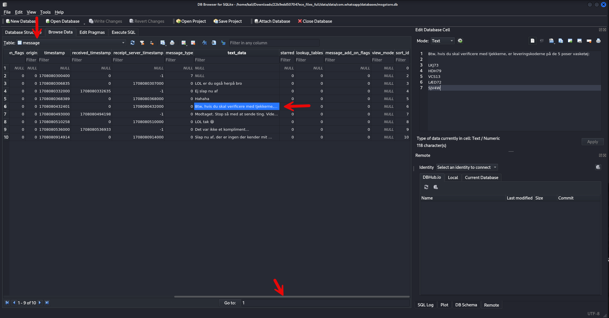

# Drilske Dæknavne - Leverance-IDer
Denne opgave er i forlængelse af serien om "Drilske Dæknavne". Denne del tage udgangspunkt i, at du har læst ["email"](./Drilske%20Dæknavne%20-%20Email.md) først.

## Opgaven
Opgavebeskrivelsen er den samme om i første del om "email", dog er følgende tilføjet: 

> Er der nogle leverance-ID'er, stregekoder eller andet på de stoffer der bliver solgt til Jens? Hvis ja, så er det et flag formateret som "DDC{A12C2-LL902-.....-KDJ82}" i den oplyste rækkefølge

## Løsning
Der er ikke umiddelbart nogen hints til, hvor man kan finde disse "leverance-ID'er" på telefonen. Jeg faldt faktisk over dem under løsningen af opgaven om "email", da jeg undersøgte de forskellige apps. 

Den eneste ledetråd er, at vi skal kigge på de forskellige apps til at kommunikere, altså Snapchat, Whatsapp og SMS som udgangspunkt.

Men der bliver i opgavebeskrivelsen nævnt appen "Whatsapp", som vi endnu ikke har fundet nogen brugbare spor i, så lad os tage et kig der. 

```
┌──(kali㉿kali)-[~/…/22b9edd507047ece_files_full/data/data/com.whatsapp]
└─$ ll
total 36
drwxr-xr-x  2 kali kali 4096 Feb 16 05:43 app_account_switching
drwxr-xr-x  2 kali kali 4096 Feb 16 05:43 app_minidumps
drwxr-xr-x 13 kali kali 4096 Feb 16 06:32 cache
drwxr-xr-x  2 kali kali 4096 Feb 16 05:42 code_cache
drwxr-xr-x  2 kali kali 4096 Apr 13 13:24 databases
drwxr-xr-x 16 kali kali 4096 Feb 16 06:15 files
drwxr-xr-x  2 kali kali 4096 Feb 16 05:43 lib-main
drwxr-xr-x  2 kali kali 4096 Feb 16 05:43 no_backup
drwxr-xr-x  2 kali kali 4096 Feb 16 06:32 shared_prefs
```

Vi kigger igen i `databases/` for at se, om vi kan finde noget opbevaret data (forhåbentligt nogle samtaler).

```
┌──(kali㉿kali)-[~/…/data/data/com.whatsapp/databases]
└─$ ll
total 4156
-rw-r--r-- 1 kali kali    4096 Feb 16 05:58 account_switcher.db
-rw-r--r-- 1 kali kali   32768 Feb 16 06:32 account_switcher.db-shm
-rw-r--r-- 1 kali kali   32992 Feb 16 05:58 account_switcher.db-wal
-rw-r--r-- 1 kali kali  262144 Feb 16 05:59 axolotl.db
-rw-r--r-- 1 kali kali   32768 Feb 16 05:59 axolotl.db-shm
-rw-r--r-- 1 kali kali  440872 Feb 16 05:59 axolotl.db-wal
-rw-r--r-- 1 kali kali    4096 Feb 16 05:44 chatsettings.db
-rw-r--r-- 1 kali kali   32768 Feb 16 06:32 chatsettings.db-shm
-rw-r--r-- 1 kali kali   49472 Feb 16 05:44 chatsettings.db-wal
-rw-r--r-- 1 kali kali    4096 Feb 16 05:44 companion_devices.db
-rw-r--r-- 1 kali kali   32768 Feb 16 05:44 companion_devices.db-shm
-rw-r--r-- 1 kali kali   37112 Feb 16 05:44 companion_devices.db-wal
-rw-r--r-- 1 kali kali    4096 Feb 16 05:58 daily_metrics.db
-rw-r--r-- 1 kali kali   32768 Feb 16 05:58 daily_metrics.db-shm
-rw-r--r-- 1 kali kali   49472 Feb 16 05:58 daily_metrics.db-wal
-rw-r--r-- 1 kali kali    4096 Feb 16 05:48 emojidictionary.db
-rw-r--r-- 1 kali kali   32768 Feb 16 05:55 emojidictionary.db-shm
-rw-r--r-- 1 kali kali  395552 Feb 16 05:48 emojidictionary.db-wal
-rw-r--r-- 1 kali kali   16384 Feb 16 05:55 _jobqueue-WhatsAppJobManager
-rw-r--r-- 1 kali kali    8720 Feb 16 05:43 _jobqueue-WhatsAppJobManager-journal
-rw-r--r-- 1 kali kali    4096 Feb 16 05:44 location.db
-rw-r--r-- 1 kali kali   32768 Feb 16 06:32 location.db-shm
-rw-r--r-- 1 kali kali   53592 Feb 16 05:44 location.db-wal
-rw-r--r-- 1 kali kali    4096 Feb 16 05:58 media.db
-rw-r--r-- 1 kali kali   32768 Feb 16 05:58 media.db-shm
-rw-r--r-- 1 kali kali   57712 Feb 16 05:58 media.db-wal
-rw-r--r-- 1 kali kali 1548288 Feb 16 07:46 msgstore.db
-rw-r--r-- 1 kali kali    4096 Feb 16 05:44 payments.db
-rw-r--r-- 1 kali kali   32768 Feb 16 05:44 payments.db-shm
-rw-r--r-- 1 kali kali   82432 Feb 16 05:44 payments.db-wal
-rw-r--r-- 1 kali kali    4096 Feb 16 05:43 stickers.db
-rw-r--r-- 1 kali kali   32768 Feb 16 05:44 stickers.db-shm
-rw-r--r-- 1 kali kali  276072 Feb 16 05:43 stickers.db-wal
-rw-r--r-- 1 kali kali    4096 Feb 16 05:43 sync.db
-rw-r--r-- 1 kali kali   32768 Feb 16 06:32 sync.db-shm
-rw-r--r-- 1 kali kali  119512 Feb 16 05:43 sync.db-wal
-rw-r--r-- 1 kali kali  385024 Feb 16 07:41 wa.db
```

Der er igen en lang række databaser, som vi kan tage et kig på i SQLite browser. 

Dog tiltrækker en bestemt database noget opmærksomhed, nemlig `msgstore.db`, som med al sandsynlighed må indeholde nogle beskeder. 

Der er en meget lang række af tabeller, men der findes en tabel med navnet: `message`, som godt kunne være interessant. 

Til al held findes der 10 beskeder i Whatsapp, som er mellem de to kriminelle.
Der bliver også nævnt noget om at "verificere", hvorefter der gives de 5 koder, som vi er på udkig efter.



Her finder vi så de koder, der skal bruges, som så skal sættes sammen med bindestreg. 

```
DDC{LKJ73-HDH79-VCS13-LÆD72-SJV4W}
```
