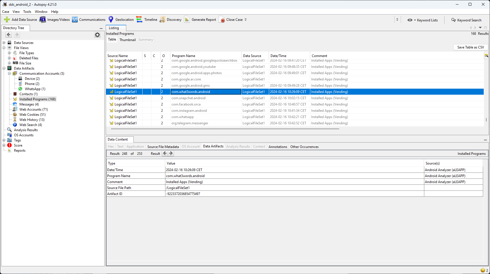
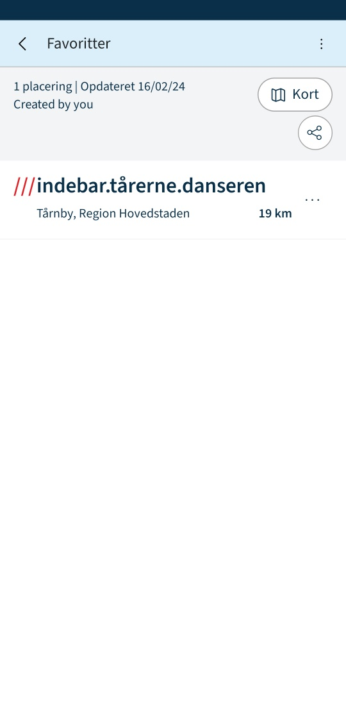

# Drilske Dæknavne - Meeting
Denne opgave er i forlængelse af serien om "Drilske Dæknavne". Denne del tage udgangspunkt i, at du har læst ["email"](./Drilske%20Dæknavne%20-%20Email.md) først.

## Opgaven
Opgavebeskrivelsen er den samme om i første del om "email", dog er følgende tilføjet:

> Til sidst har vi brug for at vide hvor Martin og Jens skal mødes. Vi mistænker de bruger en form for kodet lokation således flaget vil fremgå som en tre-delt kode som xxxx.xxxx.xxxx af en vilkårlig længde.

## Løsning
I forbindelse med starten af opgaven, kørte jeg telefonen gennem Autopsy. 
Her blev bemærket, at telefonen har installeret appen: `What3Words`, som er en app, der kan give en placering på jorden via 3 ord, man kan huske. 
Det er derfor oplagt, at flaget skal findes som en lokation bestemt af tre ord.



Men hvor kan man finde en adresse, Martin har gemt? 

Der har ikke været 3 ord nævnt i noget af det korrespondance, man har kunnet læse i fx SMS eller Whatsapp, men da vi løste opgaven om adressen, var vi inde og kigge på screenshots i telefonen.

Der findes screenshots på telefonen i stien:
```
/data/system_ce/0/snapshots
```

På et af de screenshots, vi finder, er der netop 3 ord, som viser en adresse.

Flaget er dermed:
```
DDC{indebar_tårerne_danseren}
```



